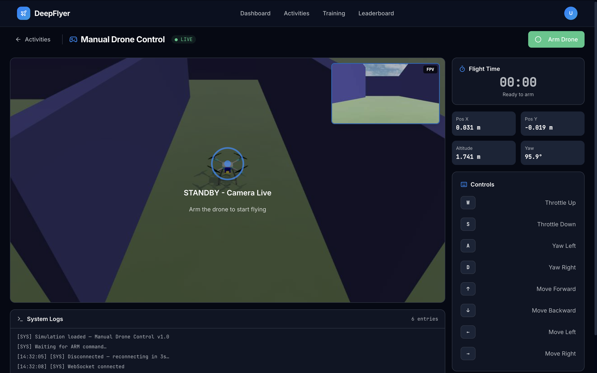
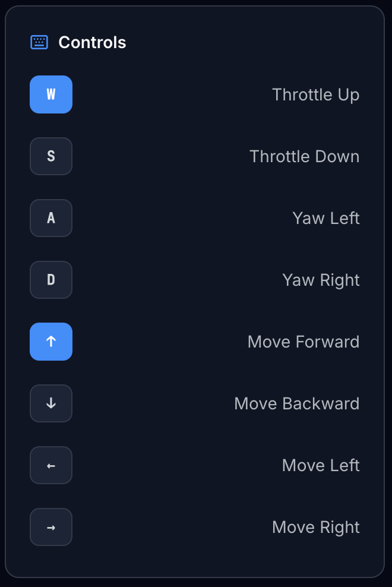

# Manual Drone Control <span class="badge-beginner">Beginner</span>

<div class="activity-header">
<h2>Activity 1 of 5 &nbsp;·&nbsp; Beginner</h2>
<div class="activity-meta">
  <span>⏱ 10-15 minutes</span>
  <span>🎮 Keyboard flight</span>
  <span>📡 Live telemetry</span>
  <span>Route: <code>/activities/manual-control</code></span>
</div>
</div>

## What This Activity Is About

You take direct keyboard control of a simulated drone. Arm it, climb to altitude, fly around, then disarm. While you fly, live telemetry shows your exact position and heading so you can see how your inputs translate into movement.



---

## Learning Goals

- Understand the axes of drone movement (throttle, yaw, forward/back, left/right)
- Read live position and heading data from the telemetry panel
- Complete a flight session without crashing

---

## Page Layout

| Area | What is there |
|---|---|
| Top bar | Activity name, connection status dot, ARM/DISARM button |
| Left side, top | Live drone camera feed |
| Left side, bottom | Scrollable log terminal |
| Right side, top | Flight timer |
| Right side, middle | Telemetry readouts: X, Y, Altitude, Yaw |
| Right side, bottom | Keyboard controls reference with live highlights |

---

## Step-by-Step

### Step 1: Wait for Connection, Then Wait a Bit More

When the page loads, watch the status dot in the top bar.

| Status | What to do |
|---|---|
| <span class="status-connecting">● CONNECTING...</span> | Wait, the container is starting up |
| <span class="status-live">● LIVE</span> | Connection is up, but keep waiting |

!!! warning "LIVE does not mean ready to arm"
    After the dot turns green, the simulation environment is still finishing its setup in the background. **Wait 1 to 2 minutes after seeing LIVE before clicking ARM.** This is a known issue and will be fixed in a future update.

---

### Step 2: Arm the Drone

Click the green **ARM** button in the top-right corner.

Once armed:

- The button turns red and shows **DISARM**
- The flight timer starts
- The log prints a confirmation:

```
[CMD] Arm requested...
[SYS] Drone armed and ready.
```

!!! warning "ARM button greyed out?"
    That means the WebSocket is not connected yet. Wait for the green <span class="status-live">● LIVE</span> dot before trying again.

---

### Step 3: Take Off

Hold **W** to apply throttle and climb. Watch the **Altitude** readout on the right.

- Let go of W when Altitude reaches about **1.5 m**
- The drone hovers in place when no keys are held

!!! tip "Use short presses"
    A long hold on W sends you up fast. Tap W in one-second bursts at first until you feel comfortable with the response.

---

### Step 4: Fly

Keys are active the moment you press them and stop the moment you release.

=== "Movement Keys"

    | Key | What it does |
    |---|---|
    | `W` | Climb |
    | `S` | Descend |
    | `Arrow Up` | Fly forward |
    | `Arrow Down` | Fly backward |
    | `Arrow Left` | Move left |
    | `Arrow Right` | Move right |

=== "Rotation Keys"

    | Key | What it does |
    |---|---|
    | `A` | Yaw left (rotate anti-clockwise) |
    | `D` | Yaw right (rotate clockwise) |

    Yaw changes the direction the drone is **facing**, not its position. Use yaw to point at where you want to go, then use Arrow Up to fly that way.

=== "Combining Keys"

    You can hold multiple keys at the same time:

    | Goal | Keys to hold |
    |---|---|
    | Fly diagonally forward and left | Arrow Up + Arrow Left |
    | Climb while moving forward | W + Arrow Up |
    | Orbit a point (roughly) | Arrow Up + D |

The Controls panel on the right side highlights each key in amber as you press it.

{width="40%"}

!!! info "The page will not scroll while you are armed"
    The arrow keys and WASD are captured by the activity to prevent accidental page scrolling during flight. This is normal.

---

### Step 5: Read the Telemetry

The four readouts on the right update in real time:

| Readout | What it shows |
|---|---|
| **Pos X** | Distance forward (+) or backward (-) from your start point, in metres |
| **Pos Y** | Distance left (+) or right (-) from your start point, in metres |
| **Altitude** | Height above the ground, in metres |
| **Yaw** | Heading in degrees: 0 is North, 90 is East, -90 is West |

The log also prints telemetry snapshots while keys are held:

```
[TEL] pos=(1.24, -0.50, 1.51) yaw=45
```

---

### Step 6: Land and Disarm

1. Fly back toward your start position (Pos X and Y close to 0).
2. Hold **S** until Altitude reads about 0.2 m.
3. Click **DISARM**. The drone lands and your score is saved.

---

## Log Prefix Reference

| Prefix | Example message | What it means |
|---|---|---|
| `[SYS]` | `Simulation loaded` | System events: startup, connection, arming |
| `[CMD]` | `Arm requested...` | A command was sent |
| `[TEL]` | `pos=(0.41, 0.00, 1.50) yaw=0` | Position update while flying |
| `[ERR]` | `Not connected to drone` | Something went wrong |

---

## Common Problems

| Problem | Likely cause | Fix |
|---|---|---|
| Drone climbs too fast | Held W too long | Tap S briefly to descend, then use shorter W presses |
| Drone spins but does not move | Using A/D instead of arrow keys | A and D rotate; arrow keys move |
| Keys are not responding | Page lost focus | Click anywhere on the activity page to refocus |
| ARM button is greyed out | Not yet connected | Wait for the green LIVE dot |

---

## Up Next

[Activity 2: Waypoint Navigation](waypoint-navigation.md) - set a course and watch the drone fly it autonomously.
