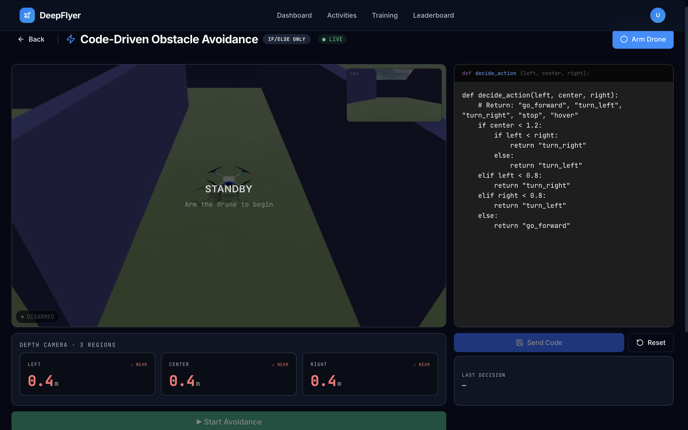
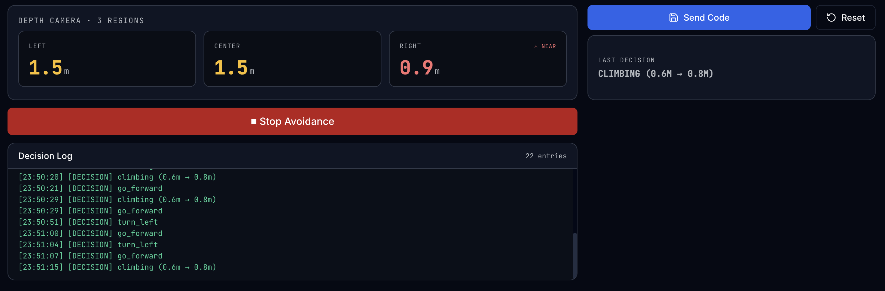

# Obstacle Avoidance <span class="badge-beginner">Beginner</span>

<div class="activity-header">
<h2>Activity 3 of 5 &nbsp;·&nbsp; Beginner</h2>
<div class="activity-meta">
  <span>⏱ 15-20 minutes</span>
  <span>🧩 If/else logic</span>
  <span>📡 Depth camera</span>
  <span>Route: <code>/activities/obstacle-avoidance</code></span>
</div>
</div>

## What This Activity Is About

The drone is placed in an environment with obstacles. You write if/else rules that read the drone's depth camera regions and decide which direction to fly. Your code runs live on the drone the moment you click Start Avoidance. No programming experience is required; only if/else statements are supported.



---

## Learning Goals

- Understand how depth camera region readings are used to make decisions
- Write if/else rules that keep the drone moving while avoiding collisions
- Get a collision-free run (score 900 or above earns the No Collision badge)

---

## Page Layout

| Area | What is there |
|---|---|
| Top bar | Activity name, IF/ELSE ONLY badge, status dot, ARM button |
| Right | Code editor with Deploy and Reset buttons |
| Left | Live drone camera feed |
| Right, bottom | Last Decision indicator |
| Left, middle | Depth camera region readings (left, centre, right) |
| Left, bottom | Logs |

---

## Step-by-Step

### Step 1: Wait for Connection, Then Wait a Bit More

Check the status dot. Wait for <span class="status-live">● LIVE</span>, then wait an additional **1 to 2 minutes** before arming. The simulation environment continues loading after the WebSocket connects.

!!! warning "Known issue"
    Arming immediately after LIVE appears may not work. Give it 1 to 2 minutes first. This will be fixed in a future update.

---

### Step 2: Read the Default Logic

The code editor opens with a working example already loaded. Read through it before making any changes so you understand the structure.

```
IF distance_front < 0.8
    TURN_RIGHT
ELSE IF distance_left < 0.8
    TURN_LEFT
ELSE
    MOVE_FORWARD
```

This tells the drone:

- If something is within 0.8 m directly ahead, turn right
- If something is within 0.8 m to the left, turn left
- Otherwise keep moving forward

!!! warning "If/else only"
    The code editor accepts only `IF`, `ELSE IF`, and `ELSE` statements. Loops and functions are not supported. This is intentional so the activity stays focused on decision logic.

---

### Step 3: Arm the Drone

Click **ARM**. The drone takes off to a fixed hover height and waits.

```
[SYS] Drone armed and ready.
[SYS] Waiting for avoidance logic...
```

---

### Step 4: Click Start Avoidance

Click **Start Avoidance**. This activates the avoidance system and immediately sends whatever logic is currently in the editor to the drone.

```
[LOGIC] Deploying custom code...
[LOGIC] Avoidance logic active.
```

!!! info "Logic is sent automatically when you click Start Avoidance"
    You do not need a separate Deploy step after clicking Start Avoidance. The code in the editor is pushed to the drone the moment you press the button.

Watch the **Last Decision** panel on the right. It updates in real time to show which rule is currently firing (for example, TURN RIGHT or MOVE FORWARD).



---

### Step 5: Update Logic While Running

If you edit your code after the drone is already running, click **Deploy Logic** to push the updated rules to the drone without stopping the session. The Last Decision panel will reflect the new rules immediately.

---

### Step 6: Watch and Adjust

Observe the drone navigating. If it gets stuck or crashes:

1. Click **DISARM**
2. Edit the logic in the code editor
3. Click **ARM** again, then **Start Avoidance** again

You can iterate as many times as you need. There is no penalty for adjusting your logic between runs.

---

### Step 7: Reset to Default

Click **Reset to Default** if you want to go back to the original example code and start fresh.

---

### Step 8: Complete a Clean Run

Get the drone through the obstacle course without a collision. A score of 900 or above earns the **No Collision** badge.

---

## Depth Camera Regions

The drone uses a **depth camera** that is divided into three horizontal regions. Each region gives the distance in metres to the nearest obstacle within that field of view.

| Variable | Camera region | Range |
|---|---|---|
| `distance_left` | Left region of the depth camera | 0.1 m and above |
| `distance_front` | Centre region of the depth camera | 0.1 m and above |
| `distance_right` | Right region of the depth camera | 0.1 m and above |

When a value drops below your threshold, there is an obstacle close within that region. There is no rear-facing sensor; the drone cannot detect obstacles behind it.

---

## Available Commands

| Command | What the drone does |
|---|---|
| `MOVE_FORWARD` | Fly forward at a fixed speed |
| `TURN_LEFT` | Yaw left (rotate anti-clockwise) |
| `TURN_RIGHT` | Yaw right (rotate clockwise) |
| `STOP` | Hover in place |

!!! note "No MOVE_BACKWARD"
    There is no rear-facing depth camera region, so there is no sensor data to drive backward movement safely. Use `TURN_LEFT` or `TURN_RIGHT` to escape tight spots instead.

---

## Logic Examples

=== "Simple (2 rules)"

    Works in open corridors. Gets stuck in dead ends.

    ```
    IF distance_front < 0.8
        TURN_RIGHT
    ELSE
        MOVE_FORWARD
    ```

=== "Balanced (4 rules)"

    Handles most layouts. Good starting point.

    ```
    IF distance_front < 1.0
        IF distance_left > distance_right
            TURN_LEFT
        ELSE
            TURN_RIGHT
    ELSE IF distance_left < 0.6
        TURN_RIGHT
    ELSE IF distance_right < 0.6
        TURN_LEFT
    ELSE
        MOVE_FORWARD
    ```

=== "Conservative (wide thresholds)"

    More reaction time. Slower but fewer crashes.

    ```
    IF distance_front < 1.5
        IF distance_left > distance_right
            TURN_LEFT
        ELSE
            TURN_RIGHT
    ELSE IF distance_left < 1.0
        TURN_RIGHT
    ELSE IF distance_right < 1.0
        TURN_LEFT
    ELSE
        MOVE_FORWARD
    ```

---

## Common Problems

| Problem | Cause | Fix |
|---|---|---|
| Drone keeps spinning in circles | No MOVE_FORWARD in the else clause | Add a final `ELSE MOVE_FORWARD` |
| Clips side walls while moving forward | No side sensor checks | Add rules for `distance_left` and `distance_right` |
| Crashes before turning | Threshold too low (under 0.5 m) | Raise thresholds to 0.8-1.2 m |
| Logic does nothing after Start Avoidance | Drone not armed before clicking Start Avoidance | Arm first, then click Start Avoidance |

---

## Up Next

[Activity 4: PID Tuning](pid-tuning.md) - adjust the nine controller gains that govern how precisely the drone tracks a flight path.