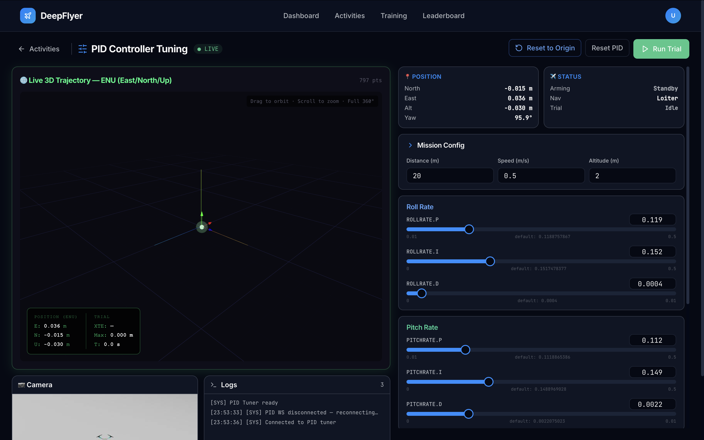
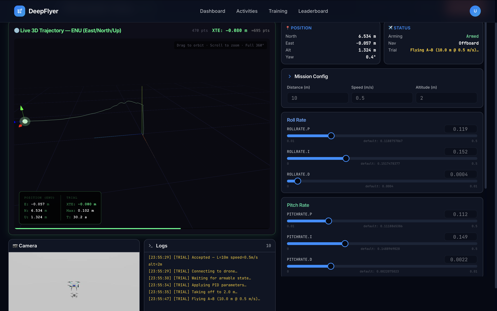

# PID Controller Tuning Intermediate

<h2>Activity 4 of 5 &nbsp;·&nbsp; Intermediate</h2>

  ⏱ 20-30 minutes
  📐 Control theory
  📊 Cross-track error (XTE)
  Route: <code>/activities/pid-tuning</code>

## What This Activity Is About

You adjust the nine rate-controller gains (Proportional, Integral, and Derivative for each of Roll, Pitch, and Yaw) and see how they affect how well the drone follows a straight-line test path. A live 3D trajectory viewer shows the actual path flown versus the ideal line. The goal is to reduce **cross-track error (XTE)**: how far the drone drifts off the intended course.

---

## Learning Goals

- Understand what the P, I, and D terms each do to drone behaviour
- Reduce cross-track error (XTE) by adjusting gains one at a time
- Compare different gain configurations and note which performs best

---

## What is a PID Controller?

A PID controller keeps running in the background, constantly adjusting motor outputs to track a target (such as a heading or altitude). It has three terms:

| Term | Name | What it does | Too high | Too low |
|---|---|---|---|---|
| **P** | Proportional | Reacts to the current error right now | Oscillation and wobble | Sluggish, large steady error |
| **I** | Integral | Corrects for drift that persists over time | Slow, sluggish response | Constant offset drift |
| **D** | Derivative | Smooths out rapid changes | Noise amplification | Underdamped oscillation |

There are three axes (Roll, Pitch, Yaw) with three terms each, giving nine gains in total.

---

## Page Layout

| Area | What is there |
|---|---|
| Top left | 3D trajectory viewer |
| Top right | Arming State and Navigation State panels |
| Center right | Nine gain sliders: Roll P/I/D, Pitch P/I/D, Yaw P/I/D |
| Bottom | Live drone camera, log terminal |

---

## Step-by-Step

### Step 1: Wait for Connection, Then Wait a Bit More

Before arming, confirm both of these:

1. Status dot shows ● LIVE
2. **Arming State** panel shows `Standby`

Then wait an additional **1 to 2 minutes** after LIVE appears. The simulation environment finishes loading after the WebSocket connects, and arming too early will have no effect.

!!! warning "Known issue"
    Arming immediately after LIVE appears may not work. Give it 1 to 2 minutes first. This will be fixed in a future update.

---

### Step 2: Note the Default Gains

Write down or screenshot the starting values on each slider. These are your baseline. Your goal is to beat the XTE you get with these values.

---

### Step 3: Arm and Watch the Baseline

Click **ARM**. The drone takes off and begins flying the test path automatically.

The **3D Trajectory Viewer** starts drawing immediately:

- Dotted line: the ideal straight path
- Solid line: where the drone actually flew

Note the **XTE** value in the metrics panel. That is your starting point.

**XTE targets:**

| XTE | Rating |
|---|---|
| Below 0.20 m | Excellent |
| 0.20 to 0.50 m | Good |
| 0.50 to 1.00 m | Needs work |
| Above 1.00 m | Poor |

---

### Step 4: Tune One Gain at a Time

Change one slider, wait 5-10 seconds, then evaluate before touching anything else. This is the only reliable way to know what each change is doing.

=== "Tuning Roll P"

    Start here. Roll P controls how aggressively the drone corrects side-to-side tilt.

    - Increase Roll P a little. Does lateral drift get smaller?
    - If the drone starts wobbling left and right, Roll P is too high. Back it off.
    - Find the highest P value that does not cause wobble.

=== "Tuning Roll D"

    Once P is roughly right, add a small amount of D.

    - D smooths out fast oscillations. Increase it if the drone wobbles after a P change.
    - Increase in very small steps (0.001 at a time). Too much D amplifies sensor noise.

=== "Tuning Roll I"

    Only add I if the drone drifts steadily to one side even after P and D are set.

    - I cancels out persistent offset. A small value (0.001 to 0.003) is usually enough.
    - Too much I causes a slow, oscillating overshoot.

=== "Pitch and Yaw"

    Repeat the same P then D then I process for Pitch (forward/back tilt) and Yaw (heading).

    - Pitch tuning reduces forward/backward drift.
    - Yaw tuning keeps the drone pointing in the right direction along the path.
    - Yaw is usually less sensitive than Roll and Pitch.

---

### Step 5: Disarm When Done

Click **DISARM**. Your best XTE and score for that session are saved automatically.

---

## State Indicator Reference

### Arming State

| State | Meaning |
|---|---|
| Init | System starting up |
| Standby | Ready to arm |
| Armed | Motors on, flying |
| Standby Error | A problem prevented arming |
| In Air Restore | Re-arming after an unexpected disarm |

### Navigation State

| State | Meaning |
|---|---|
| Manual | RC input (not used here) |
| Position | GPS-stabilised hold |
| Offboard | DeepFlyer is sending flight commands (this is the active mode) |
| Takeoff | Automated takeoff in progress |

---

## Reference Gain Values

### Conservative (stable, higher XTE)

| Gain | Value |
|---|---|
| Roll P / I / D | 0.04 / 0.001 / 0.002 |
| Pitch P / I / D | 0.04 / 0.001 / 0.002 |
| Yaw P / I / D | 0.08 / 0.003 / 0.001 |

### Well-tuned example

| Gain | Value |
|---|---|
| Roll P / I / D | 0.08 / 0.003 / 0.006 |
| Pitch P / I / D | 0.08 / 0.003 / 0.006 |
| Yaw P / I / D | 0.15 / 0.008 / 0.002 |

---

## Common Problems

| Problem | Cause | Fix |
|---|---|---|
| Drone wobbles left and right | Roll P too high | Reduce Roll P by 30% |
| Drone drifts but no wobble | P too low | Increase P first, then add small I |
| New wobble appeared after a D change | D increment too large | Halve the D value |
| Hard to tell what is working | Changed multiple gains at once | Reset one slider at a time and test individually |

---

## Up Next

[Activity 5: RL Training](reinforcement-learning.md) - instead of hand-tuning parameters, an AI agent discovers its own flight strategy through trial and error.