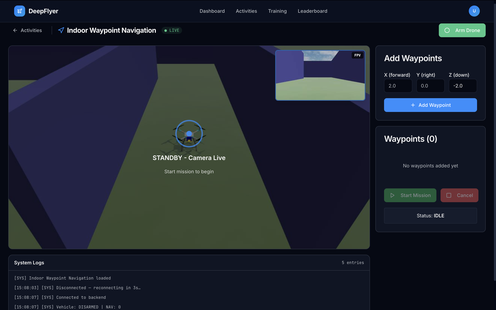
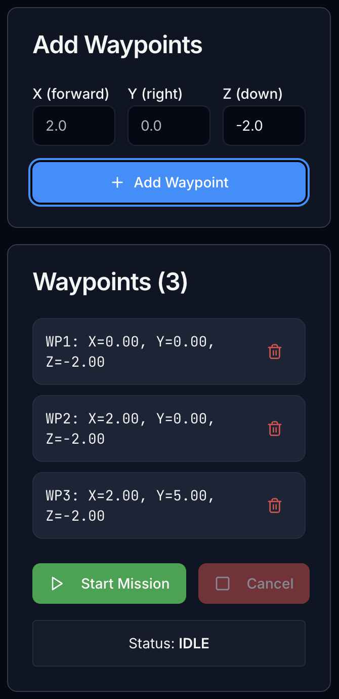

# Waypoint Navigation <span class="badge-beginner">Beginner</span>

<div class="activity-header">
<h2>Activity 2 of 5 &nbsp;·&nbsp; Beginner</h2>
<div class="activity-meta">
  <span>⏱ 10-15 minutes</span>
  <span>🗺 Autonomous flight</span>
  <span>📐 Trajectory analysis</span>
  <span>Route: <code>/activities/waypoint-navigation</code></span>
</div>
</div>

## What This Activity Is About

You place a series of 3D waypoints, then the drone flies to each one automatically. There is no manual flying here. Your job is to place the waypoints thoughtfully, watch how the autopilot handles the path, and think about why the drone flies the shape it does.



---

## Learning Goals

- Set up a multi-waypoint mission with sensible 3D positions
- Watch how the drone plans and follows an autonomous flight path
- Think about trajectory efficiency: how close to a straight line does the drone actually fly?

---

## Page Layout

| Area | What is there |
|---|---|
| Top bar | Activity name, connection status, ARM/DISARM button |
| Left | Live drone camera feed |
| Centre | Waypoint input panel: add, edit, reorder waypoints |
| Right | Mission control buttons, trajectory display, log terminal |

---

## Step-by-Step

### Step 1: Wait for Connection, Then Wait a Bit More

Check the status dot. Wait for <span class="status-live">● LIVE</span> to appear, then wait an additional **1 to 2 minutes** before arming. The simulation environment needs time to fully load after the connection is established.

!!! warning "Known issue"
    Arming immediately after LIVE appears may not work. Give it 1 to 2 minutes first. This will be fixed in a future update.

---

### Step 2: Add Your Waypoints

In the **Waypoints** panel, add at least 3 waypoints.

1. Click **Add Waypoint**.
2. Enter the **X**, **Y**, and **Z** coordinates.
3. Repeat until you have at least 3 waypoints.
4. Waypoints are numbered in the order they will be visited.

{width="40%"}

**What the coordinates mean:**

| Axis | Direction | Suggested range |
|---|---|---|
| X | Forward (+) or backward (-) from start | -5 to +5 m |
| Y | Left (+) or right (-) from start | -5 to +5 m |
| Z | **Negative = up, positive = down** | **-1.5 to -3.0 m** |

!!! warning "Z is negative for altitude - this is not a typo"
    DeepFlyer uses the **NED coordinate frame** (North-East-Down), which is the standard for PX4 and real drones. In this frame, Z is positive pointing **downward** and negative pointing **upward**.

    - `Z = 0` means ground level (drone will land)
    - `Z = -1.5` means 1.5 m above the ground
    - `Z = -3.0` means 3.0 m above the ground

    Always use **negative Z values** to fly above ground. A waypoint with Z = 0 or any positive Z value will send the drone into the floor.

---

### Step 3: Check Your Mission Before Starting

Before you hit Start Mission, quickly review:

- Are the waypoints at least **2 metres apart**? Closer than that and the segments are too short to observe properly.
- Are all Z values **negative**? Any Z = 0 or positive Z will make the drone go to ground level at that waypoint.
- Do the X and Y values trace a path you want to see?

---

### Step 4: Arm and Start the Mission

1. Click **ARM**. The drone takes off to the altitude of the first waypoint.
2. Once airborne, click **Start Mission**.
3. The drone flies to waypoint 1, then 2, then 3, and so on.

The log confirms each waypoint as it is reached:

```
[SYS] Mission started - 3 waypoints
[SYS] Navigating to waypoint 1: (3.0, 0.0, -1.5)
[SYS] Reached waypoint 1
[SYS] Navigating to waypoint 2: (3.0, 3.0, -1.5)
[SYS] Reached waypoint 2
[SYS] Mission complete - hovering at final waypoint
```

---

### Step 5: Watch the Flight

While the drone flies, observe:

=== "Path Shape"

    Is the drone flying a straight line between waypoints, or is it curving?

    A straight path means the autopilot is tracking cleanly. A curved path means the controller is making corrections along the way, which is normal at higher speeds or with closely-spaced waypoints.

=== "Waypoint Arrival"

    Does the drone stop cleanly at each waypoint, or does it overshoot and loop back?

    Overshooting at low speeds is a sign the approach velocity was too high.

=== "Altitude Changes"

    If your waypoints have different Z values, watch how the drone handles the transition. Does it climb and move forward at the same time, or does it reach the target altitude first?

    Remember: a **more negative Z** means **higher altitude**. Going from Z = -1.5 to Z = -2.5 means the drone climbs 1 metre.

---

### Step 6: Finish the Mission

- **Let it complete:** The drone hovers at the last waypoint when all waypoints are done. Click **DISARM** to save your score.
- **Cancel early:** Click **Cancel Mission** at any time. The drone lands and your current score is saved.

---

## Mission Ideas to Try

| What to test | Waypoint setup |
|---|---|
| Simple L-shape | (3, 0, -1.5) then (3, 3, -1.5) then (0, 3, -1.5) |
| Altitude changes | (2, 0, -1.5) then (2, 2, -2.5) then (0, 2, -1.5) |
| Tight turns | Waypoints 1 metre apart in a zigzag, all at Z = -1.5 |
| Long straight segments | Waypoints 5 metres apart in a line, all at Z = -1.5 |

---

## Common Problems

| Problem | Cause | Fix |
|---|---|---|
| Drone lands or dips mid-mission | A waypoint has Z = 0 or a positive Z | Edit the waypoint and set Z to -1.5 or lower (more negative = higher) |
| Mission button does not work | Drone is not armed | Arm the drone first, then click Start Mission |
| Path looks very curved | Waypoints are too close together | Space them at least 2 metres apart |

---

## Up Next

[Activity 3: Obstacle Avoidance](obstacle-avoidance.md) - write if/else logic that the drone executes in real time to avoid obstacles.
