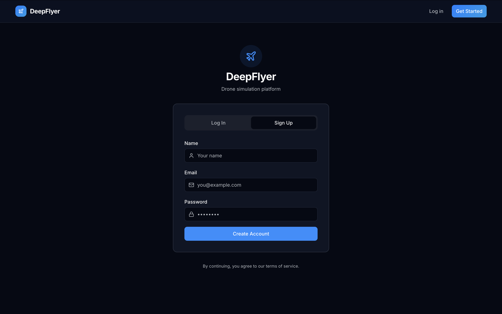
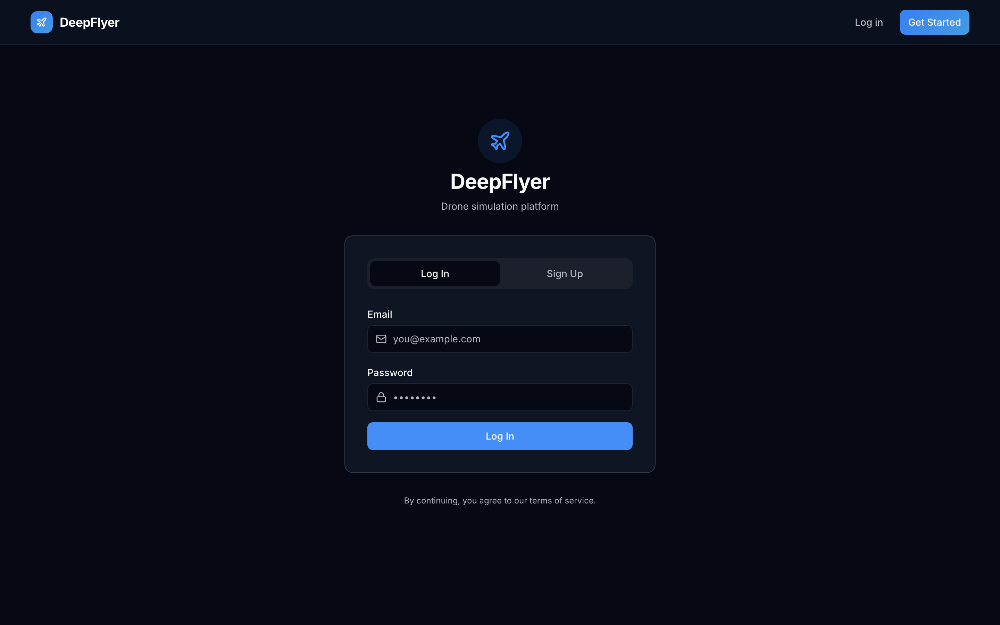
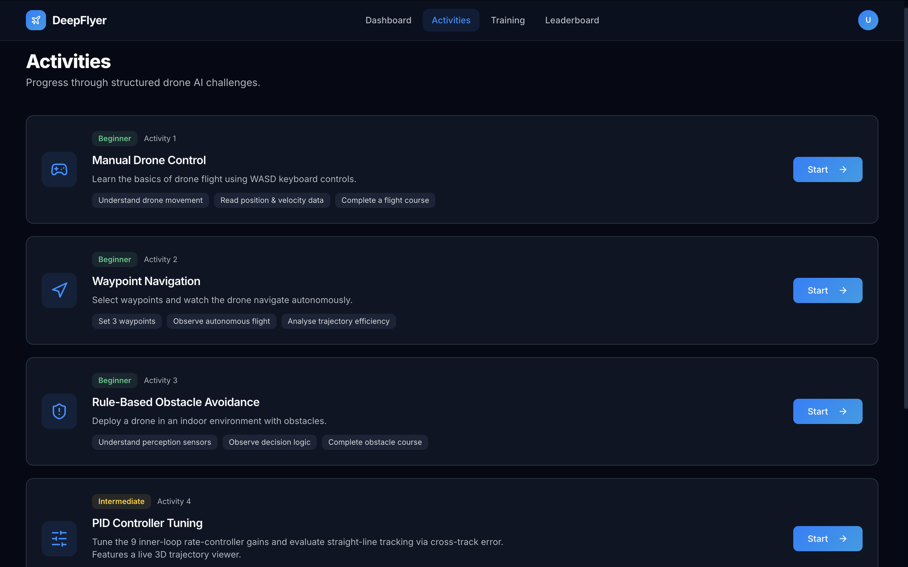

# Quick Start

Follow these five steps to go from a blank browser tab to flying your first simulated drone.

---

## Step 1: Create Your Account

1. Open the DeepFlyer homepage and click **Start Flying**, or go directly to `/login`.
2. Click the **Sign Up** tab.
3. Enter your **Full Name**, **Email address**, and a **Password**.
4. Click **Create Account**.

You will be taken straight to your Dashboard once the account is created.

!!! note "Your display name"
    The name you enter here appears on the Leaderboard and your Dashboard. Pick something you are comfortable having publicly visible.

---

## Step 2: Log In on Future Visits

1. Go to `/login` or click **Log In** in the top navigation bar.
2. Enter your **Email** and **Password**.
3. Click **Sign In**.

---

## Step 3: Open the Activities Page

After logging in, click **Activities** in the top navigation bar.

You will see five activity cards. Each card shows the difficulty level, a short description, and three learning goals.

---

## Step 4: Start Activity 1

1. Find the **Manual Drone Control** card (Activity 1).
2. Click **Start** on the right side of the card.
3. A loading screen appears while your simulation container starts. This takes about **30 seconds** on every launch.
4. The activity page opens automatically once everything is ready.

!!! warning "Wait after LIVE before arming"
    Even after the status dot turns green and shows LIVE, wait **1 to 2 minutes** before clicking ARM. The simulation environment needs extra time to finish loading after the WebSocket connects. Arming too early may not work. This will be fixed in a future update.

---

## Step 5: Fly

Once the activity page loads:

1. Wait for the status dot in the top bar to turn green and show **● LIVE**.
2. Wait an additional **1 to 2 minutes** after LIVE appears before arming. The simulation environment needs time to finish loading after the connection is established.
3. Click the green **ARM** button in the top-right corner.
4. Press **W** on your keyboard to climb.
5. Use the **arrow keys** to move around.
6. Click **DISARM** when you are done.

Your flight time and score are saved automatically when you disarm.

---

## Where to Go Next

| I want to | Go here |
|---|---|
| Learn all the keyboard controls | [Manual Control Guide](../activities/manual-control.md) |
| Understand my Dashboard stats | [Dashboard](../platform/dashboard.md) |
| See all five activities | [All Activities](../activities/index.md) |
| Learn about the status indicators and session system | [The Interface](interface.md) |
