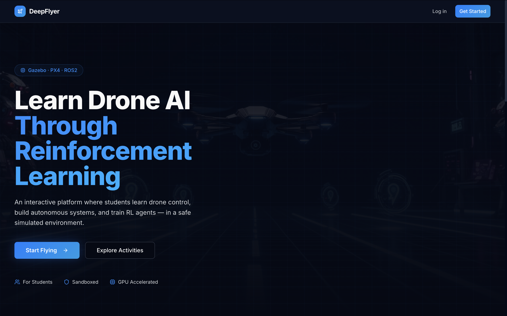

# DeepFlyer

**Learn Drone AI Through Reinforcement Learning**

DeepFlyer is a browser-based platform for learning drone control, autonomous navigation, and AI training, all inside a safe cloud simulation powered by Gazebo, PX4, and ROS 2. No downloads or hardware needed.

---

## What You Can Do

🚁
Fly a Drone
Keyboard controls, live video

🗺
Plan Missions
Waypoint autopilot

🧩
Write Logic
If/else obstacle avoidance

📐
Tune a Controller
PID gains, 3D trajectory

🧠
Train an AI Agent
Live reward graph, leaderboard

---

## Five Activities, One Learning Path

Each activity builds on the last, taking you from basic flight to running your own AI experiment.

1
Manual Control
Beginner - 15 min

2
Waypoint Nav
Beginner - 15 min

3
Obstacle Avoidance
Beginner - 20 min

4
PID Tuning
Intermediate - 30 min

5
RL Training
In Progress

---

## Where Do I Start?

| If you want to... | Go here |
|---|---|
| Create an account and fly for the first time | [Quick Start](getting-started/quickstart.md) |
| Learn the site navigation and session system | [The Interface](getting-started/interface.md) |
| Browse all five activities | [All Activities](activities/index.md) |
| Check your stats, badges, and ranking | [Dashboard](platform/dashboard.md) |
| Read about the tech stack | [Technical Docs](technical/index.md) |

---

!!! info "Each activity start takes about 30 seconds"
    Every time you launch an activity, the platform spins up a fresh simulation container for you. This takes around 30 seconds. Once the status dot turns green, wait an additional **1 to 2 minutes** before arming the drone to give the simulation environment time to fully load.
