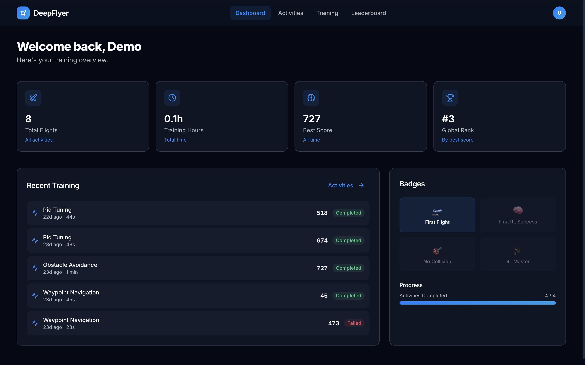
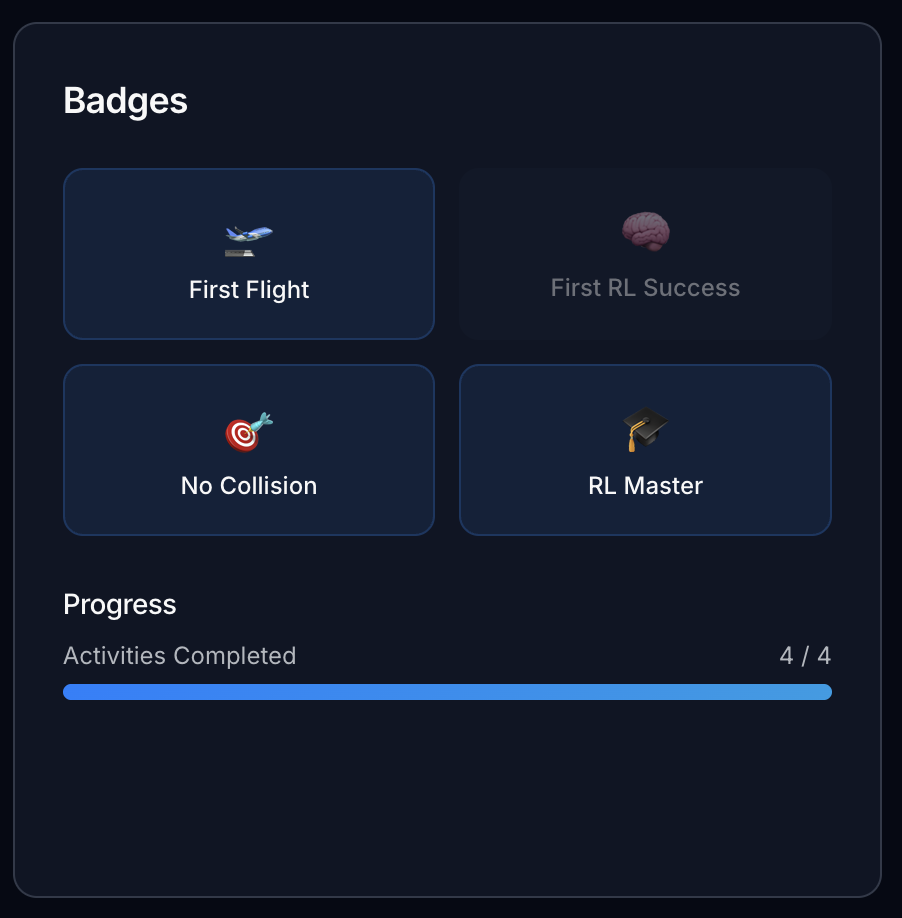

# Dashboard

Your personal training home. It loads automatically after login and is always accessible from **Dashboard** in the top navigation bar.

---

## Stat Cards

Four cards at the top of the page give a quick summary of your training history.

| Card | What it shows |
|---|---|
| **Total Flights** | Every simulation run you have started, completed or not |
| **Training Hours** | Total armed flight time across all sessions |
| **Best Score** | Your highest single-run score across all activities |
| **Global Rank** | Your position on the all-activities leaderboard (shows a dash until you have at least one score) |

---

## Recent Training

The **Recent Training** panel lists your last several runs in reverse chronological order.

Each row shows the activity name, how long ago the run was, how long it lasted, the score, and whether it was **Completed** (green) or **Failed** (red).

Only Completed runs appear on the Leaderboard. Failed runs are still saved here so you can track your history.

!!! note "Nothing showing yet?"
    If you have not run any activity, the panel shows a prompt to start your first flight. Click the link in the panel to go to the Activities page.

---

## Badges

The **Badges** panel shows all four achievable badges. Badges you have earned are fully coloured. Badges you have not earned yet are dimmed.

{width="35%"}

| Badge | How to earn it |
|---|---|
| 🛫 First Flight | Complete any activity for the first time |
| 🧠 First RL Success | Complete any RL Training run |
| 🎯 No Collision | Score 900 or higher on Obstacle Avoidance |
| 🎓 RL Master | Score 950 or higher on any activity |

Badges are awarded automatically when the condition is met. You do not need to claim them.

---

## Progress Bar

Below the badges, a progress bar shows how many of the four activity types you have completed at least once. The bar fills as you complete each distinct activity for the first time.
