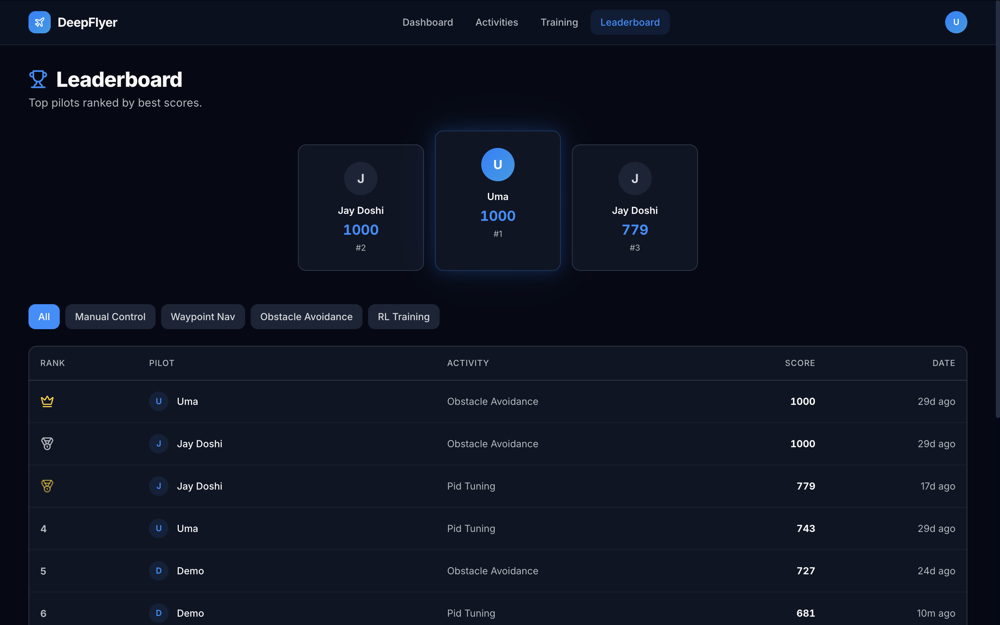
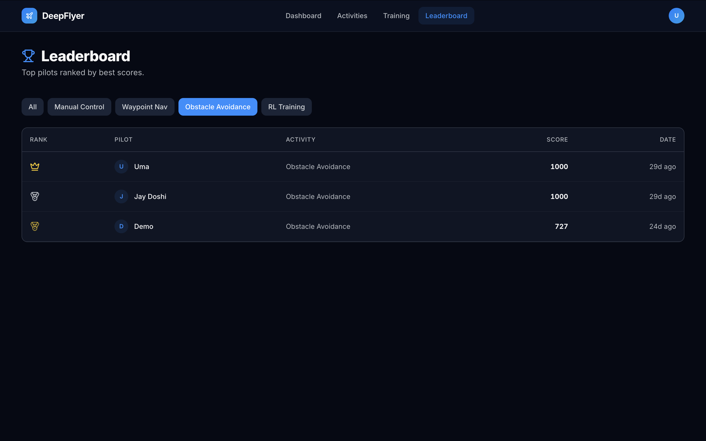

# Leaderboard

The Leaderboard ranks all pilots by their best score. It is accessible from the top navigation bar and visible to any logged-in user.

---

## Top 3 Podium

When the **All** filter is selected and at least three users have scores, the top three pilots are shown in a podium layout above the main table.

| Position | Where it appears |
|---|---|
| 1st place | Centre, elevated, with a glowing border and crown icon |
| 2nd place | Left, slightly lower, with a silver medal icon |
| 3rd place | Right, slightly lower, with a bronze medal icon |

---

## Filtering by Activity

Use the filter tabs to narrow down the table to a specific activity.

| Tab | What it shows |
|---|---|
| All | The highest single score per user across all activities |
| Manual Control | Activity 1 scores only |
| Waypoint Nav | Activity 2 scores only |
| Obstacle Avoidance | Activity 3 scores only |
| RL Training | Activity 5 scores only |

---

## The Rankings Table

Each row shows:

| Column | Notes |
|---|---|
| Rank | Position number. Crown for 1st, medal icons for 2nd and 3rd |
| Pilot name | The display name from the user's account |
| Activity | Which activity the score came from |
| Score | The numeric score for that run |
| Time | How long ago the score was set (for example, 3h ago) |

!!! tip "How to move up the rankings"
    Only **Completed** runs count. Crashed or failed runs are not shown. Run any activity and click Disarm at the end to save a completed score.

---

## How Scores Work

- Scores range from 0 to 1000 depending on the activity and how well the run went.
- Only your **best** completed run per activity is shown.
- You can repeat any activity as many times as you like. Improving your score will update your leaderboard position.

---

## Badges

Badges are earned in-activity and shown on your Dashboard and Profile. Here is the full list:

| Badge | What it takes |
|---|---|
| 🛫 First Flight | Complete any activity for the first time |
| 🎯 No Collision | Score 900 or higher on Obstacle Avoidance |
| 🧠 First RL Success | Complete any RL Training run |
| 🎓 RL Master | Score 950 or higher on any activity |

Badges are permanent. Once earned they stay on your profile regardless of future scores.
