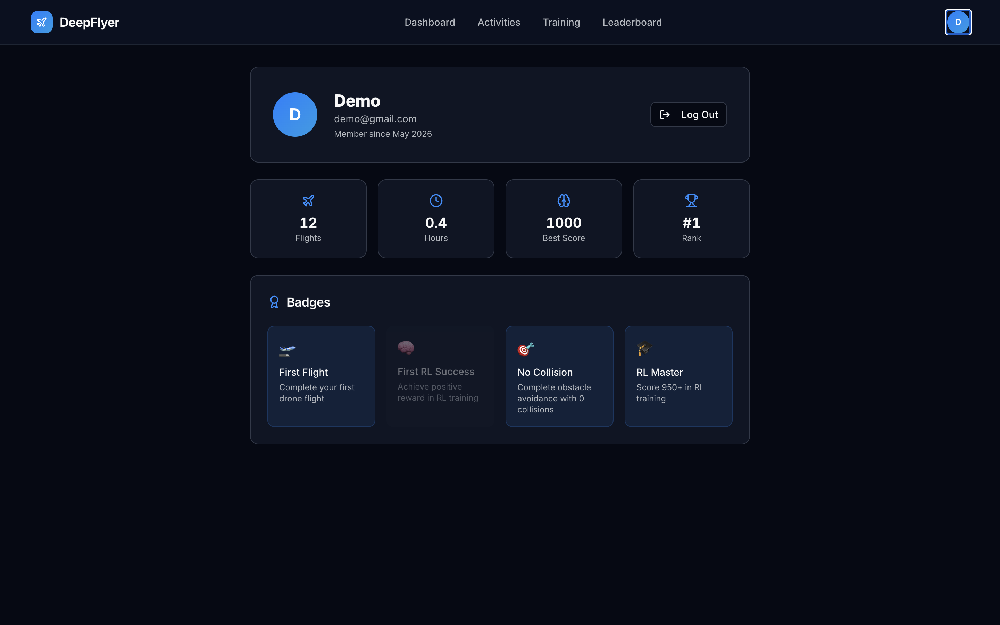

# Profile

Your Profile page shows your account information and full badge collection. Access it from **Profile** in the top navigation bar.

---

## Account Details

| Field | Notes |
|---|---|
| Display Name | The name shown on the Leaderboard and Dashboard |
| Email Address | The email you registered with, used for login |
| Member Since | Date your account was created |

!!! info "Changing your account details"
    Account editing is not available through the web UI at the moment. Contact your course administrator to update your name or email.

---

## Badges

Your Profile shows all four badges with their earned or locked state. Earned badges are fully coloured. Locked badges are dimmed and show what you need to do to earn them.

| Badge | Earned when |
|---|---|
| 🛫 First Flight | You complete any activity for the first time |
| 🎯 No Collision | You score 900 or higher on Obstacle Avoidance |
| 🧠 First RL Success | You complete any RL Training run |
| 🎓 RL Master | You score 950 or higher on any activity |

---

## Your Stats

The Profile page also shows a summary of your training statistics: total runs, total training time, best score, and your current global rank.
